[](https://github.com/rutkowski-tomasz/ExpenseSplitter.Api/actions/workflows/ci.yml)

# 💵 ExpenseSplitter

ExpenseSplitter is a Domain-Driven Design (DDD) implemented API, meticulously crafted in C#. This project serves as a vivid showcase of how Clean Architecture priciples can be applied, with an emphasis on creating a robust and scalable solution for managing expenses among users. The API allows users to create settlements, add participants, and manage expenses with flexible splitting options, ensuring a comprehensive expense settlement system.

# 🦩 Features / patterns

1. API Bold split into: Domain, Application, Infrastructure, Presentation layers
2. **Domain layer**: Entities, ValueObjects, DomainEvents, Domain Servies, Strongly typed IDs
3. **Application Layer**: CQRS using MediatR with ICommand, IQuery, ICommandHandler, IQueryHandler abstractions, Logging for ICommandHandler, Validators with handling middleware, Result-driven communication, Idempotent/duplicated request handling, Railway-oriented programming (showcase)
4. **Presentation Layer**: Minimal API with Swagger documentation, Trace ID middleware, Rate limiting.
5. **Frontend (app)**: App built using Vertical Slice Architecture with React, TypeScript, Vite, and Tailwind CSS 
6. **Infrastructure Layer**: EF Core (DbContext, Entity mapping, DB migrations, Repositories), Authentication & Authorization, Database migrations
7. **Testing**: Automated testing in CI, code coverage collection and history comparison, Architecture tests, testcontainers integration testing
8. **CI/CD**: Dependabot integration, auto weekly nuget packages updates, Trivy scanning, SonarQube static-code analysis, automatic semantic-release, docker image publishing
9. Docker support with docker-compose orchestration
10. **Observability**: OpenTelemetry integration for comprehensive monitoring, tracing, and logging with Grafana Cloud


# 🛹 Big picture

To let you quickly understand the domain and relationships of the project entities I decided to create a class diagram.

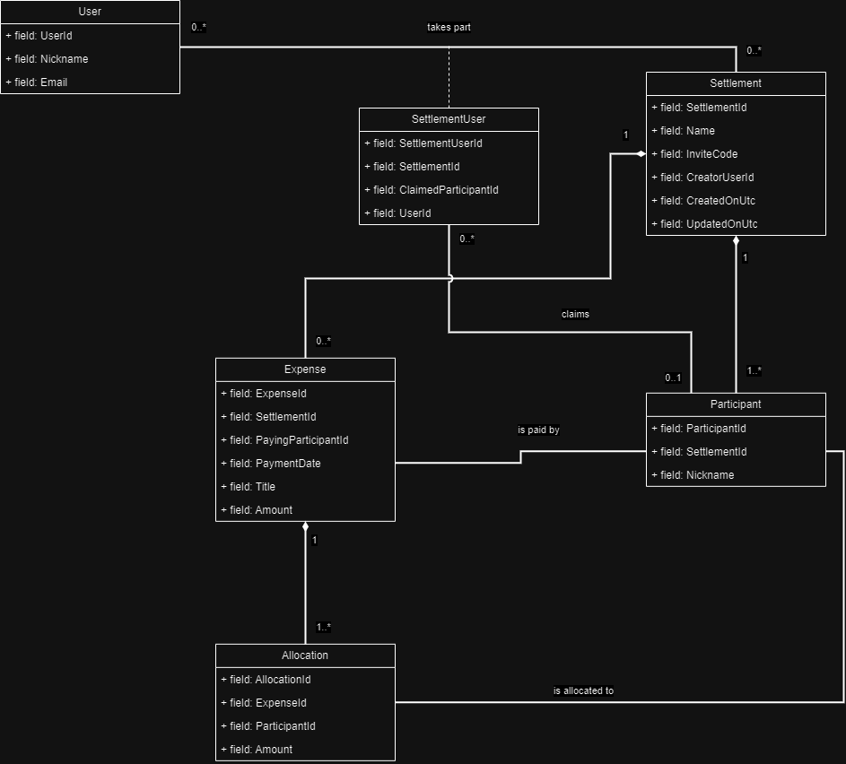

# 📸 App Screenshots

Get a quick glance at the look of ExpenseSplitter in action:

<table>
  <tr>
    <td align="center">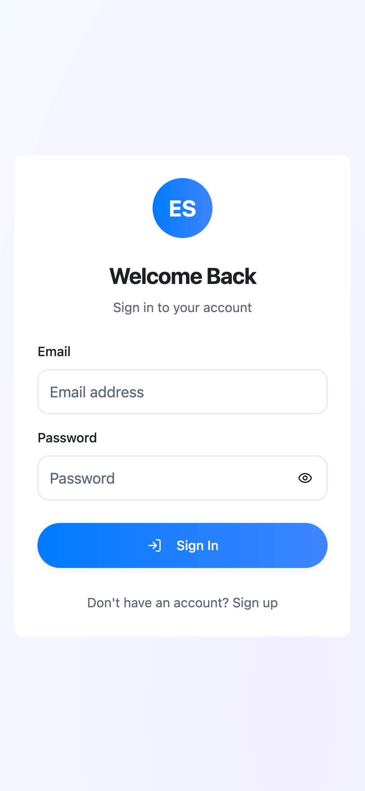<br/>Login</td>
    <td align="center">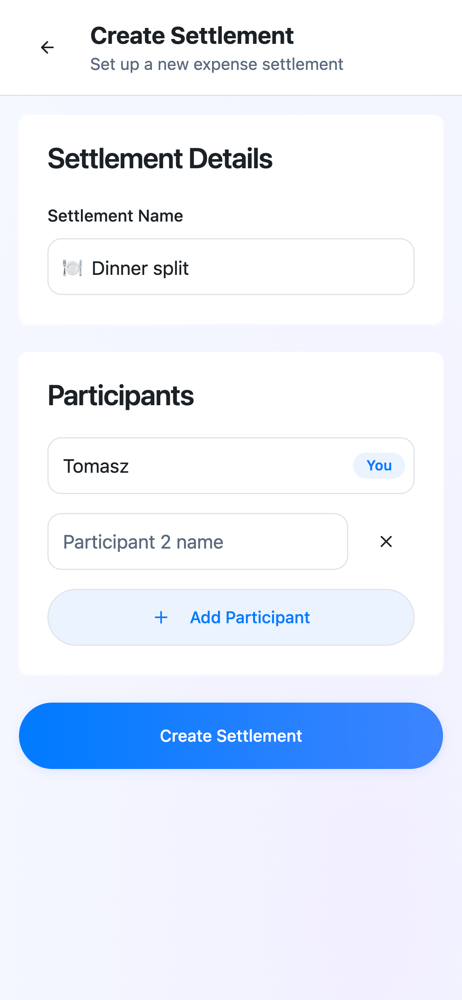<br/>Create Settlement</td>
    <td align="center">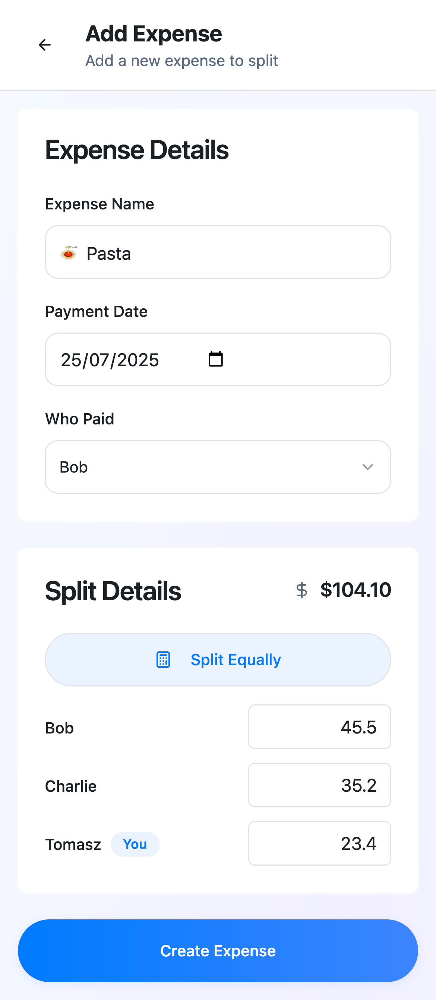<br/>Add Expense</td>
    <td align="center">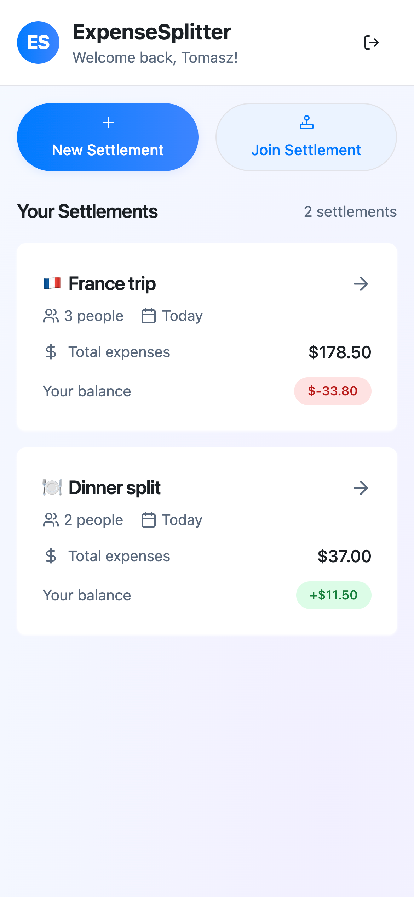<br/>Dashboard</td>
  </tr>
  <tr>
    <td align="center">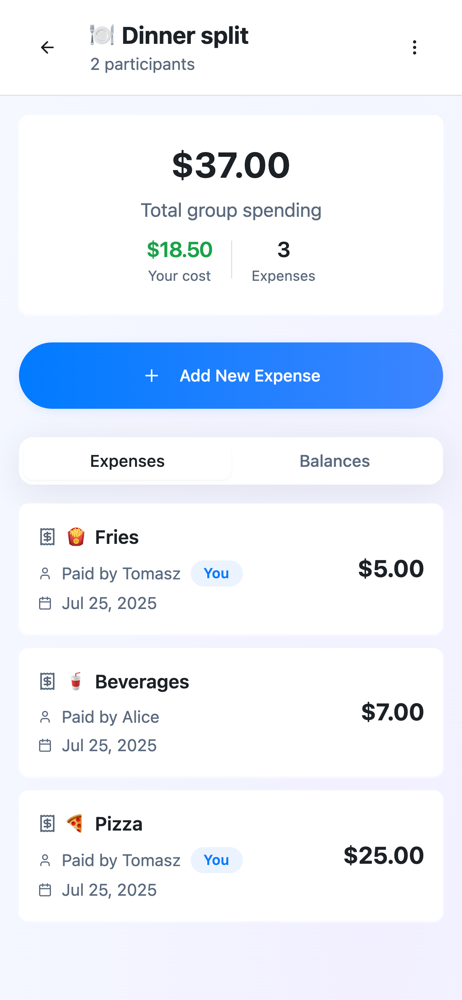<br/>Settlement Example 1</td>
    <td align="center">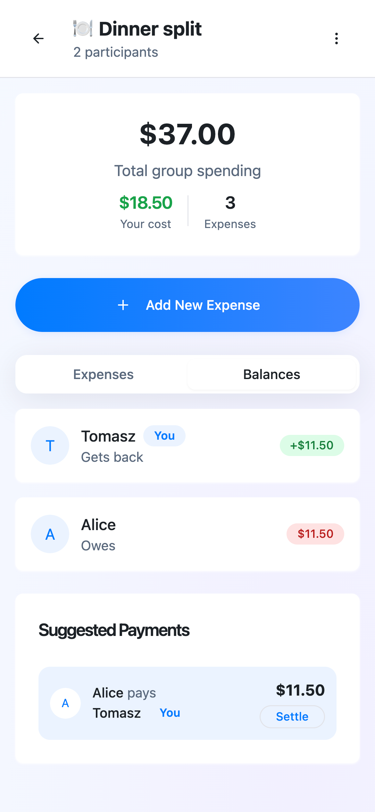<br/>Reimbursement Example 1</td>
    <td align="center">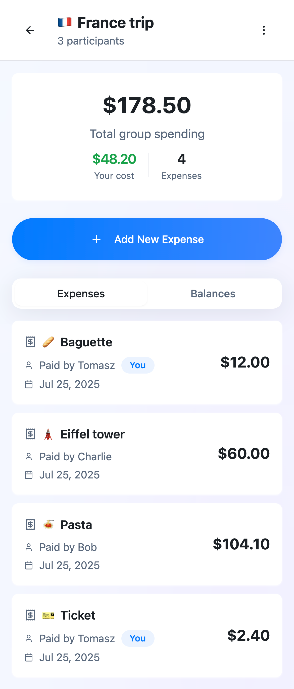<br/>Settlement Example 2</td>
    <td align="center">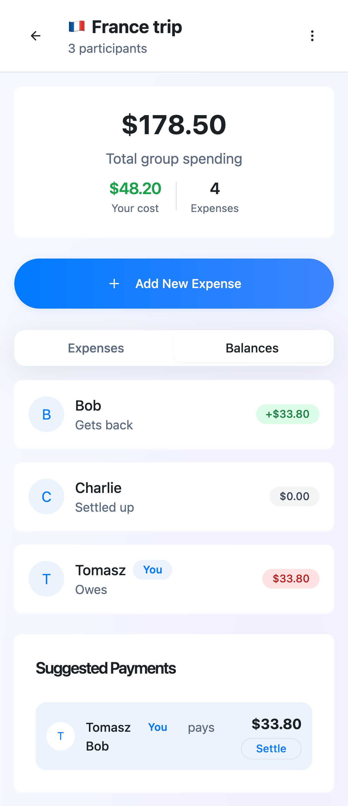<br/>Reimbursement Example 2</td>
  </tr>
  <tr>
    <td align="center">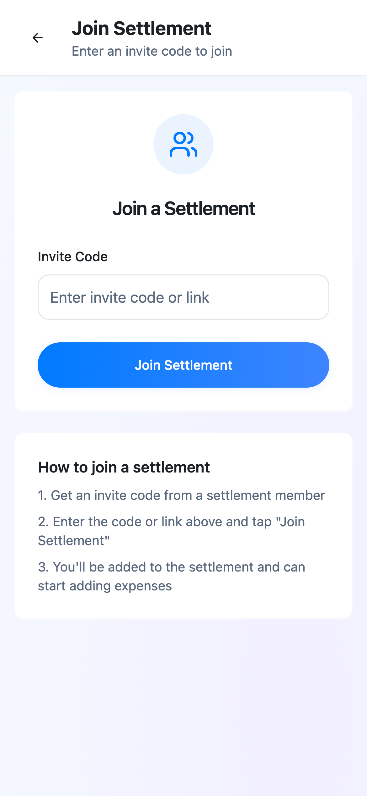<br/>Join Settlement</td>
    <td align="center">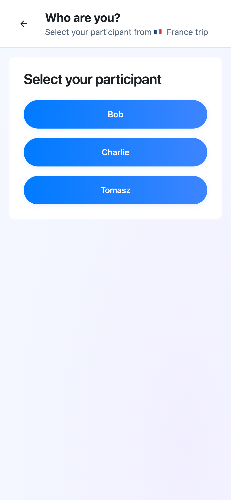<br/>Claim Participant</td>
    <td></td>
    <td></td>
  </tr>
</table>

## 🗺️ Endpoints map

| Method  | Path   | Notes  |
|---|---|---|
| 🟩 POST | /users/login | |
| 🟩 POST | /users/register | |
| 🟦 GET | /users/me | |
| 🟩 POST | /settlements | Generates invite code |
| 🟦 GET | /settlements | |
| 🟦 GET | /settlements/{settlementId} | |
| 🟨 PUT | /settlements/{settlementId} | |
| 🟥 DELETE | /settlements/{settlementId} | |
| 🟦 GET | /settlements/{settlementId}/expenses | |
| 🟨 PUT | /settlements/join | Join using invite code |
| 🟨 PUT | /settlements/{settlementId}/leave | |
| 🟦 GET | /settlements/{settlementId}/reimbursement | Balances and suggested reimbursements |
| 🟪 PATCH | /settlements/{settlementId}/participants/{participantId}/claim | |
| 🟩 POST | /expenses | |
| 🟦 GET | /expenses/{expenseId} | |
| 🟨 PUT | /expenses/{expenseId} | |
| 🟥 DELETE | /expenses/{expenseId} | |

# 🔭 Further development ideas

1. Add websockets for real time updates
2. Currency support
3. Outbox pattern
4. Model diagram

# 👨‍💻 Development


## Environment Configuration

The application uses environment variables for configuration. Copy the example environment file and configure it with your values:

```sh
cp .env.example .env
```

## Run API (backend)

```sh
dotnet run --project api/src/ExpenseSplitter.Api.Presentation/ExpenseSplitter.Api.Presentation.csproj
```

## Run App (frontend)

```sh
cd app && npm run dev
```

## Start dependencies

```sh
docker-compose up -d expensesplitter-db expensesplitter-idp expensesplitter-cache expensesplitter-pgadmin
```

## Create db migration

```sh
dotnet ef migrations add --startup-project api/src/ExpenseSplitter.Api.Presentation --project api/src/ExpenseSplitter.Api.Infrastructure ...
```
